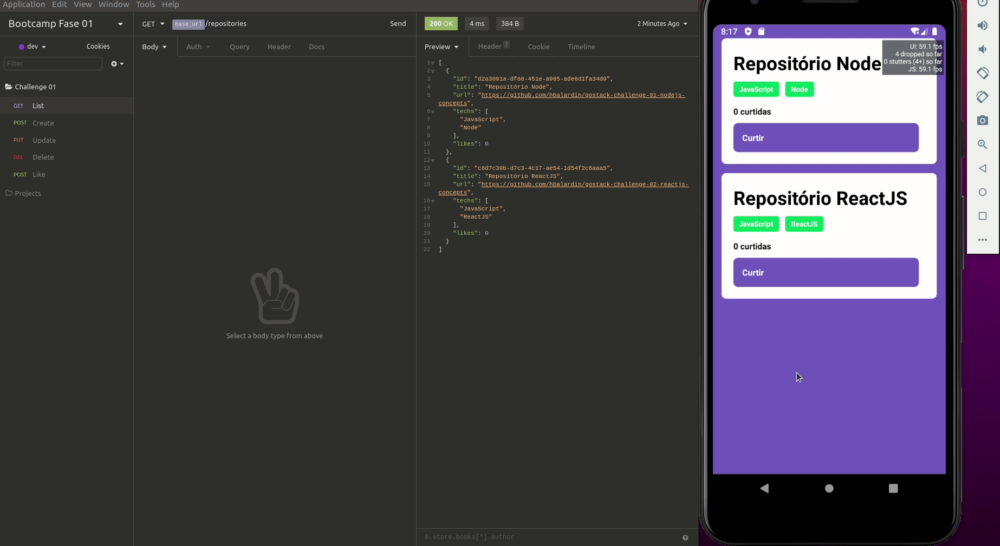

<h1 align="center">
  Challenge 03: ReactJS Concepts
</h1>

<h2 align="center">
  A mobile application for a repository manager.
</h2>

---

  

---

## About

This is a mobile application to put into practice what I have learning about the React Native concepts.

PS: This application only works with the [back-end server](https://github.com/hbalardin/gostack-challenge-01-nodejs-concepts) running.

---

## Other Challenges

- [Back-end](https://github.com/hbalardin/gostack-challenge-01-nodejs-concepts)
- [Front-end web](https://github.com/hbalardin/gostack-challenge-02-reactjs-concepts)

---

Developed by Henrique Balardin dos Santos 🚀 [Get in Touch!](https://linkedin.com/in/hbalardin)